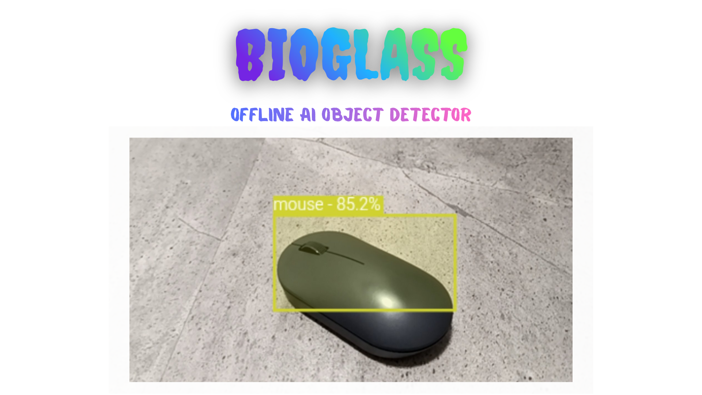

<p align="center">
  
</p>

Welcome to **Bioglass**, the futuristic offline website for **real-time object detection** using AI! This project leverages modern AI models to recognize and highlight objects through your camera—without sending your data to any server. All processing is done locally, keeping your privacy intact. Perfect for experimentation, demos, and building custom AI applications on the web.

---

## 🚀 Features

- **Real-Time Object Detection**: Detect objects in your environment instantly using your webcam.
- **Bounding Boxes & Labels**: Each object is highlighted with a colored bounding box and labeled with its class and confidence percentage.
- **Offline-First**: Runs entirely in the browser. No internet required after loading assets.
- **Cross-Platform**: Works on both desktop and mobile devices. Adjusts UI automatically for small screens.
- **Progressive Web App (PWA)**: Install Bioglass as an offline app on your device for quick access.
- **Modern AI Models**: Uses **ONNX Runtime** with YOLOv8 for fast, accurate detection.

---

## 🎯 Object Classes

Bioglass can detect over **80 classes** including:

`person, bicycle, car, motorcycle, airplane, bus, train, truck, boat, cat, dog, chair, laptop, cell phone, bottle` ...and many more.

*(Full list available in `js/main.js`)* or [wiki](https://github.com/Mavox-ID/Bioglass/wiki#-object-classes)

---

## ⚡ How It Works

1. **Initialize Models**: ONNX Runtime loads the YOLOv8 model in the browser.
2. **Camera Access**: User grants access to the webcam.
3. **Frame Processing**: Each video frame is converted to a tensor and fed into the model.
4. **Bounding Boxes & NMS**: Detected objects are filtered using Non-Maximum Suppression to avoid overlapping boxes.
5. **Rendering**: Boxes and labels are drawn on an HTML `<canvas>` overlay in real time.
6. **Interactive Controls**:  
    - **Run Inference**: Start detecting objects in full-screen mode.  
    - **Stop Inference**: Stop detection and return to the main menu.

---

## 📦 Installation & Setup

1. Clone this repository:  

```bash
git clone https://github.com/yourusername/bioglass.git
```

2. Open the project folder:

```bash
cd bioglass
```

3. Open `index.html` in a modern browser (Chrome, Edge, or Firefox). No server required.  
   ⚠️ Make sure your browser allows webcam access.

**```❗And also check if updating packages is allowed in the browser. If there is an image but no display of objects (outline), then it is not supported. Try posting it as a site and opening it, or open the```** [project site](https://bioglass.pp.ua) **``` and check the work there.❗```**

---

## ⌨ Installation from scratch without junk

If you want to install a clean project without git and other files, download this [file](https://bioglass.pp.ua/All_In_One.zip) unpack and it's ready, you can use it, upload it, etc.

---

## 🖌️ Project Structure

```
bioglass/
│
├─ index.html        # Main HTML page
├─ css/
│   └─ style.css     # Styles for desktop & mobile
├─ js/
│   ├─ main.js       # Core detection logic
│   └─ opencv.js     # OpenCV.js library
├─ model/
│   └─ yolov8n.onnx  # AI model file
├─ logo.png          # Logo for site & PWA
└─ manifest.json     # PWA manifest
```

---

## 📱 Progressive Web App (PWA) Support

Install Bioglass as an app on your device:

1. Click **Install** in your browser's address bar.
2. Launch Bioglass from your home screen.
3. Enjoy **offline AI object detection** anywhere!

---

---

## ✸ Wiki

Visit the project [wiki](https://github.com/Mavox-ID/Bioglass/wiki) for more information.

## ✏ Issues

If you have any optimization or other issues, or want to suggest an improvement, please let us know in the [issues](https://github.com/Mavox-ID/Bioglass/issues) section.

---

## 🎨 Customization

- **Add New Classes**: Edit `labels` array in `js/main.js`.  
- **Change Model**: Replace `yolov8n.onnx` with any compatible ONNX model.  
- **Styling**: Update `css/style.css` for colors, buttons, or layout.

---

## ⚡ Tech Stack

- **HTML5, CSS3, JavaScript**
- **ONNX Runtime Web**
- **OpenCV.js**
- **YOLOv8 Object Detection**
- **Progressive Web App (PWA)

---

## 🔒 Privacy & Offline Mode

- All video processing happens **locally** in your browser.  
- No frames, images, or video streams are sent to external servers.  
- Perfect for privacy-conscious users or offline environments.

---

## 🎉 Contributing

Found a bug or want to improve the UI? Contributions are welcome!  

1. Fork the repository.
2. Make your changes.
3. Submit a pull request with a clear description.

---

## 💡 Future Ideas

- Voice feedback announcing detected objects.
- Integration with additional AI models (Mask R-CNN, segmentation).
- Dark mode and theme customization.
- Export detection data to CSV or JSON.

---

## 🔗 Links

- [Site of Project](https://bioglass.pp.ua)
- [Ye-A! Website](https://ye-a.pp.ua)    
- [ONNX Runtime Web](https://onnxruntime.ai/)  
- [YOLOv8](https://github.com/ultralytics/ultralytics)  

---

## ✨ License

MIT License — free to use, modify, and distribute.  

---

> “Bioglass — seeing the world through AI eyes.” 👁️🛸
